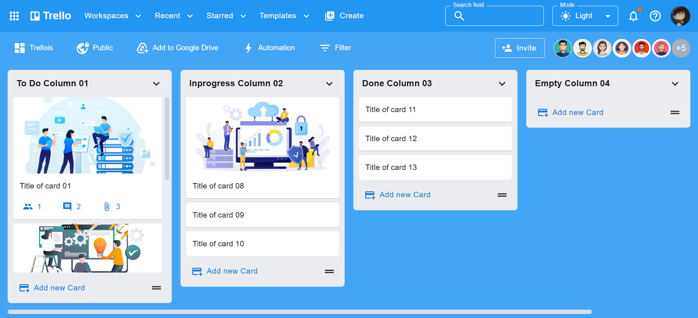

# Trello Web - MERN Stack Project

Welcome to the **Trello Web App**, a full-stack project built entirely using the **MERN stack (MongoDB, Express.js, React.js, Node.js)**. This project was developed by **Nguyen Duc Sang**, inspired by the popular project management tool Trello, to help learners master both frontend and backend technologies by building a real-world application from scratch.

This project is a practical part of the Full Stack MERN Pro Course hosted on YouTube, offering a hands-on, project-based approach to learning web development.

---

## 📌 About the Project

This is a full-featured Trello clone designed with a modern tech stack to replicate essential functionalities such as:

- Board creation
- Column management (add/edit/delete)
- Drag-and-drop cards (powered by DnD Kit)
- Member and task management
- UI/UX similar to the original Trello application

The project is written in modern **React (v18+)** using **Vite** for lightning-fast development, and styled with **Material UI** for a professional, responsive interface.

Backend services are developed using **Node.js & Express.js**, and data is stored in a **MongoDB** database. The application architecture follows best practices for scalable and maintainable code.

---

## 📦 Tech Stack

### Frontend

- **React.js** 
- **Material UI** (MUI)
- **Redux Toolkit** (State management)
- **Vite**
- **React DnD Kit** (Drag & Drop interactions)
- **React Router DOM**
- **Axios** (API requests)
- **ESLint** (code linting & standards)

### Backend

- **Node.js**
- **Express.js**
- **MongoDB & Mongoose**
- **JWT Authentication**
- **RESTful APIs**

---

## ✅ Requirements

### 🚀 Run Backend Locally

To run the backend of this project locally, ensure your environment matches the following versions, then run:
```bash
cd api

yarn i

yarn dev
```
Backend runs on: http://localhost:8017

### 💻 Run Frontend Locally

To run the frontend of this project locally, use the following commands:

```bash
cd web

yarn install

yarn dev
```
Frontend runs on: http://localhost:8173

## 🎬 Demo Video

[](https://www.youtube.com/watch?v=SojRhhMxUbI)

> 🔗 [Watch on YouTube](https://www.youtube.com/watch?v=SojRhhMxUbI)


